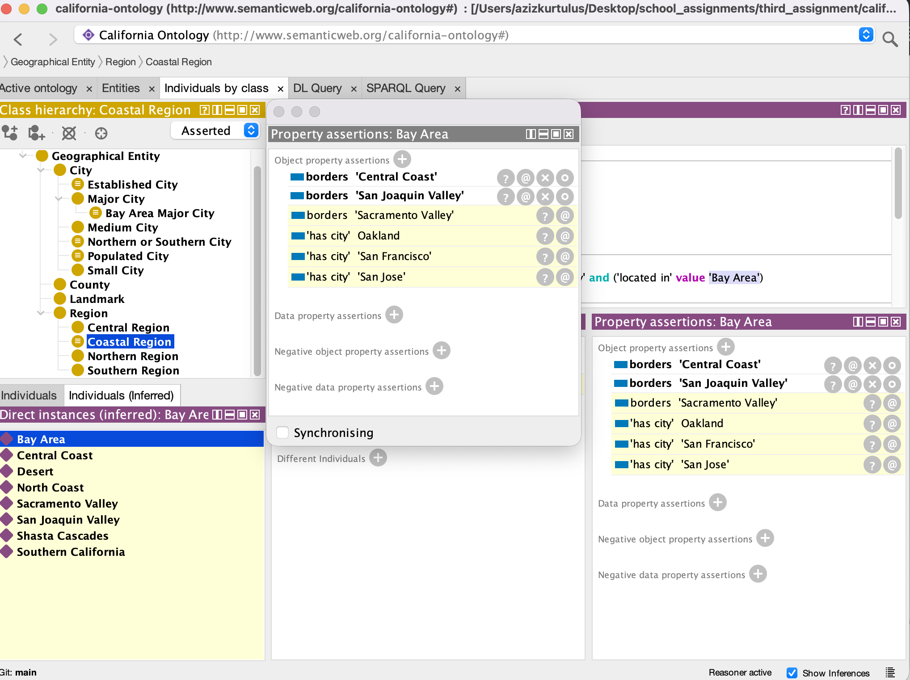
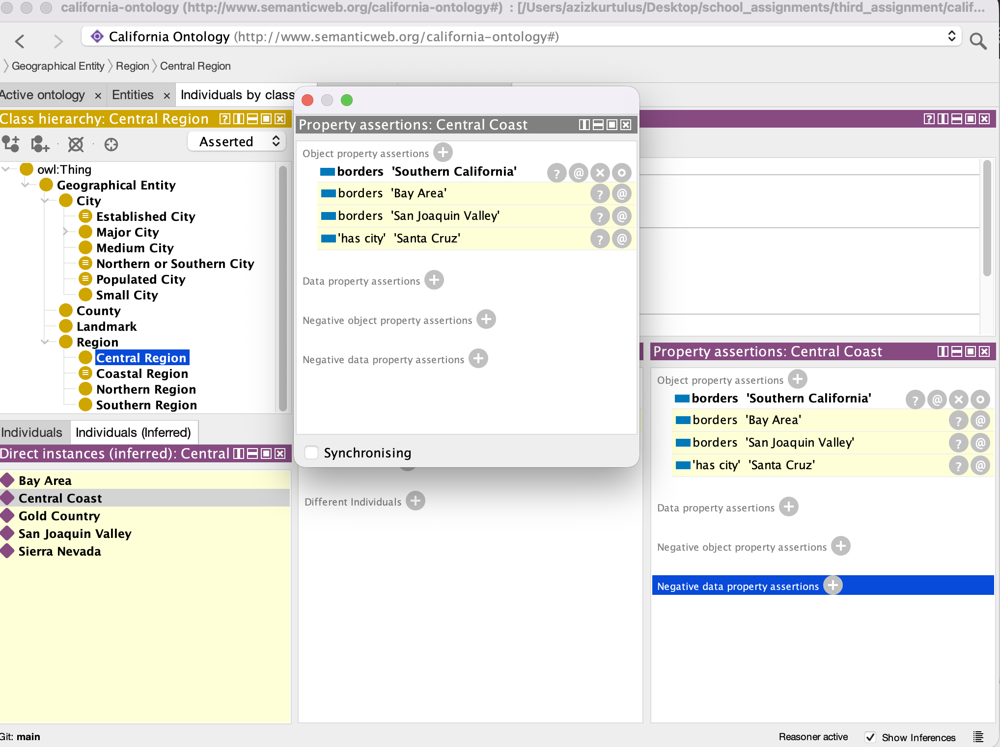

# California Ontology Documentation - Assignment 3

## Overview
This ontology models California's geographical regions, cities, and their relationships. It is based on the 10 official tourism regions of California and includes cities with their population and area data.

**For Assignment 3, the ontology has been extended with OWL constructs including intersection classes, union classes, property restrictions, inverse properties, and symmetric properties to demonstrate reasoning capabilities.**

## Ontology Extensions for Assignment 3

### New OWL Constructs Added

#### 1. Intersection Class: `BayAreaMajorCity`
- **Definition**: `MajorCity` AND `locatedIn value BayArea`
- **Purpose**: Identifies cities that are both major cities AND located in the Bay Area
- **Inferred Members**: San Francisco, San Jose
- **Screenshot**: 

#### 2. Union Class: `NorthernOrSouthernCity`
- **Definition**: Cities located in `NorthernRegion` OR `SouthernRegion`
- **Purpose**: Groups cities from either northern or southern regions
- **Inferred Members**: Eureka, Redding, Sacramento (North) + Los Angeles, San Diego, Palm Springs (South)
- **Screenshot**: 

#### 3. Property Restriction Classes

##### 3.1 `PopulatedCity`
- **Definition**: `City` AND `hasPopulation some integer`
- **Purpose**: Cities that have a population value
- **Inferred Members**: All 12 cities
- **Screenshot**: 

##### 3.2 `EstablishedCity`
- **Definition**: `City` AND `establishedYear some integer`
- **Purpose**: Cities that have an establishment year
- **Inferred Members**: All cities with establishment dates
- **Screenshot**: 

##### 3.3 `CoastalRegion`
- **Definition**: `Region` AND `hasCity min 1`
- **Purpose**: Regions that contain at least one city
- **Inferred Members**: Bay Area and other regions with cities
- **Screenshot**: 

#### 4. Inverse Object Property
- **Properties**: `locatedIn` ↔ `hasCity`
- **Logic**: If a city is `locatedIn` a region, then the region `hasCity` that city
- **Example**: San Francisco `locatedIn` BayArea → BayArea `hasCity` San Francisco (inferred)
- **Screenshot**: 

#### 5. Symmetric Object Property
- **Property**: `borders`
- **Logic**: If Region A `borders` Region B, then Region B `borders` Region A
- **Example**: BayArea `borders` CentralCoast → CentralCoast `borders` BayArea (inferred)
- **Screenshot**: 

## Reasoning Demonstrations

### Question 1: Intersection/Union Class Inference
**Demonstration**: San Francisco is inferred as `BayAreaMajorCity` because it satisfies both conditions:
- It is explicitly declared as a `MajorCity`
- It has the property `locatedIn BayArea`
The reasoner automatically classifies it as a member of the intersection class.

### Question 2: Property Restriction Inference
**Demonstration**: All cities are inferred as `PopulatedCity` because they all have the `hasPopulation` property with integer values. The reasoner examines each city's properties and automatically classifies those meeting the restriction.

### Question 3: Inverse Property Inference
**Demonstration**: The BayArea individual shows `hasCity` relationships (Oakland, San Francisco, San Jose) that were not explicitly stated but inferred from the inverse of `locatedIn`. These appear in yellow/italic in Protégé.

### Question 4: Symmetric Property Inference
**Demonstration**: The `borders` property automatically generates reciprocal relationships. When BayArea `borders` CentralCoast is asserted, the reasoner infers CentralCoast `borders` BayArea, shown as inferred (yellow) in the property assertions.

## Files Submitted
1. **california_extended.owl** - The extended ontology with all OWL constructs
2. **documentation.md** - This documentation file
3. **Screenshots**:
   - `intersection class.png` - BayAreaMajorCity inference demonstration
   - `union class.png` - NorthernOrSouthernCity inference (if available)
   - `property restriction.png` - EstablishedCity restriction
   - `property restriction_2.png` - PopulatedCity restriction
   - `property restriction_3.png` - CoastalRegion restriction
   - `inverse.png` - hasCity/locatedIn inverse property
   - `symmetric.png` - borders symmetric property (if available)

## Original Ontology Structure

### Namespace
- **Base IRI**: `http://www.semanticweb.org/california-ontology#`
- **Prefix**: `ca:`

### Class Hierarchy

#### GeographicalEntity (Top-level class)
The root class for all geographical entities in California.

**Subclasses:**
- **Region**
  - NorthernRegion
  - CentralRegion
  - SouthernRegion
  - CoastalRegion (added in Assignment 3)
- **City**
  - MajorCity (disjoint with others)
  - MediumCity (disjoint with others)
  - SmallCity (disjoint with others)
  - BayAreaMajorCity (added - intersection)
  - NorthernOrSouthernCity (added - union)
  - PopulatedCity (added - restriction)
  - EstablishedCity (added - restriction)
- **County**
- **Landmark**

### Properties

#### Object Properties
1. **locatedIn** - Links city to region
2. **hasCity** - Inverse of locatedIn
3. **borders** - Symmetric property between regions

#### Data Properties
1. **hasPopulation** - Population count (integer)
2. **hasArea** - Area in km² (float)
3. **establishedYear** - Year established (integer)

### Instances

#### Regions (10)
- Northern: NorthCoast, ShastaCascades, SacramentoValley
- Central: GoldCountry, BayArea, SierraNevada, SanJoaquinValley, CentralCoast
- Southern: Desert, SouthernCalifornia

#### Cities (12)
- Major Cities: Los Angeles, San Diego, San Jose, San Francisco
- Medium Cities: Sacramento, Fresno, Bakersfield, Oakland
- Small Cities: Santa Cruz, Palm Springs, Eureka, Redding

## Technical Details
- **Reasoner Used**: HermiT 1.4.3.456
- **Format**: RDF/XML (OWL)
- **Files**: `california_extended.owl`
- **Total Classes**: 18 (including new inference classes)
- **Total Properties**: 6 (3 object, 3 data)
- **Total Instances**: 22 (10 regions + 12 cities)
- **Validation**: Successfully tested with HermiT reasoner in Protégé